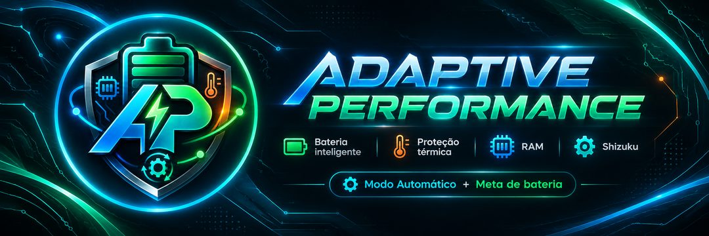
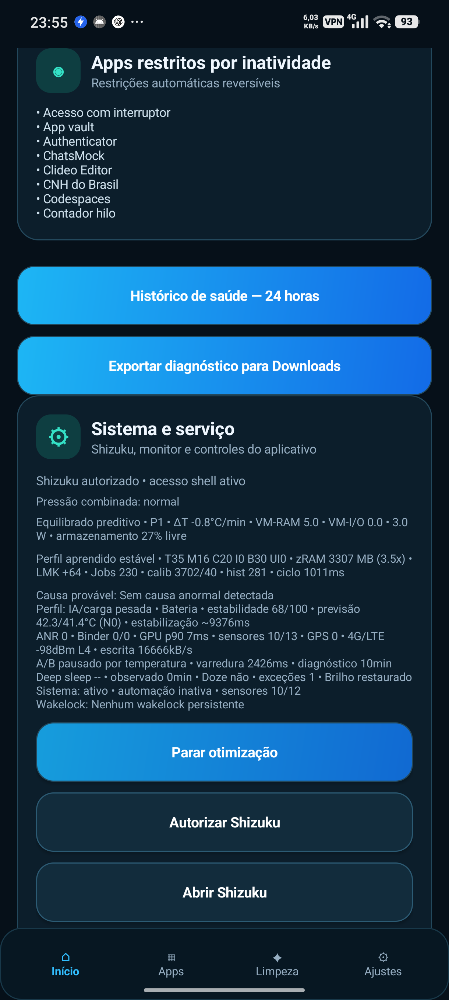
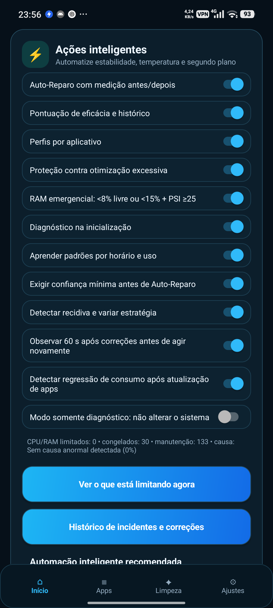
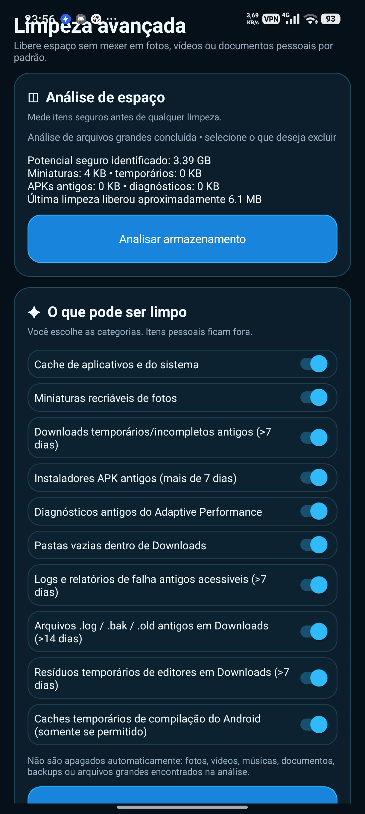
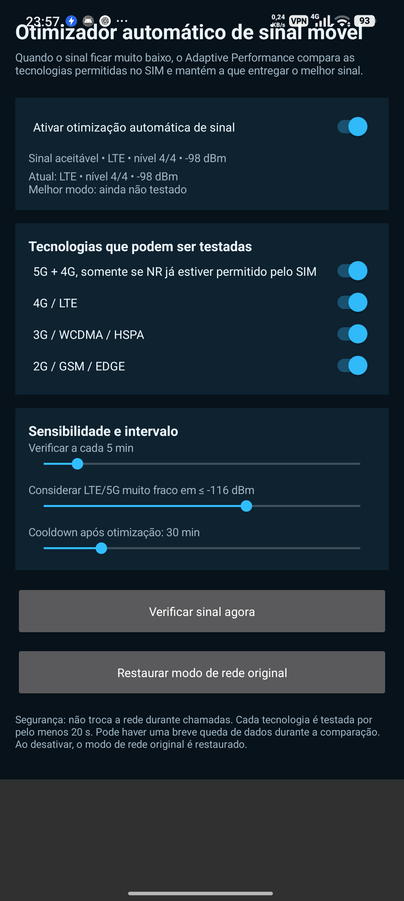

# Adaptive Performance

**Adaptive Performance** é um utilitário avançado para Android focado em desempenho adaptativo, controle térmico, gerenciamento de RAM/CPU, economia de bateria, limpeza de armazenamento, congelamento de aplicativos, diagnóstico do sistema, firewall DNS por aplicativo e otimização de sinal móvel.

O projeto foi desenvolvido principalmente para Android 16 e usa **Shizuku** para executar operações privilegiadas sem exigir root.

[Site oficial](https://langraficagr-collab.github.io/adaptive-performance/) · [Baixar a versão mais recente](https://github.com/langraficagr-collab/adaptive-performance/releases/latest)

## Idiomas / Languages

[🇧🇷 Documentação em português](README.md) · [English documentation](README.en.md) · [Site em português](https://langraficagr-collab.github.io/adaptive-performance/) · [Website in English](https://langraficagr-collab.github.io/adaptive-performance/en.html)

## Versão atual: 1.11.1 — revisão de estabilidade

**Versão Android:** `1.11.1-review-fixes` (versionCode **83**). [Baixar APK completo v1.11.1](https://github.com/langraficagr-collab/adaptive-performance/releases/download/v1.11.1/Adaptive-Performance-v1.11.1.apk) · [Release v1.11.1](https://github.com/langraficagr-collab/adaptive-performance/releases/tag/v1.11.1).

Esta atualização mantém os dez recursos do **Adaptive Brain 2.0** e todas as funções anteriores. Corrige:

- **Integridade do modelo ML local:** ao serializar o histórico de transições, ignora registros que não cabem no limite de 6.500 caracteres sem descartar registros menores posteriores. Há teste de regressão dedicado.
- **Consulta CodeRabbit:** o script do Termux filtra o login exato do bot e evita misturar mensagens de outras contas.
- **GitHub Actions / Android Lint:** detecta a instalação Android SDK do runner, só instala plataformas e build tools se estiverem ausentes e lida com licenças, evitando a falha com o pacote obsoleto `tools`.
- **Revisão de código:** CodeRabbit no PR #4; testes locais e verificadores do GitHub (Android Lint, análise Java e CodeQL). A revisão completa do PR precede o merge.

**Não houve adição de módulos em segundo plano.** A melhoria do ML é para preservação de dados do histórico, não uma promessa de economia de bateria. O APK é uma **compilação de desenvolvimento assinada** e só atualiza preservando dados quando a assinatura é compatível.

## Novidades da versão 1.11.0 — Adaptive Brain 2.0

**Versão Android:** `1.11.0-adaptive-brain2` (versionCode **82**). [Baixar APK completo v1.11.0](https://github.com/langraficagr-collab/adaptive-performance/releases/download/v1.11.0/Adaptive-Performance-v1.11.0.apk) · [Release e código-fonte](https://github.com/langraficagr-collab/adaptive-performance/releases/tag/v1.11.0).

A versão **1.11.0** inclui dez extensões que reutilizam o mesmo serviço do aplicativo. O objetivo é aprender hábitos, prever problemas e suspender apenas trabalho opcional em condições desfavoráveis. **Não são dez processos adicionais executados continuamente.**

| Recurso | Funcionamento e limites |
|---|---|
| **1. Machine Learning 2.0 contextual** | Dois modelos locais incrementais estimam atividade e risco de aquecimento usando tela, CPU, RAM, bateria, carregamento e horário. Necessita **48 amostras**, espaçadas em pelo menos **3 minutos**, antes de decisões por ML. |
| **2. Previsão do próximo aplicativo** | Aprendizado de até **32 transições**; prioriza o app previsto somente se estiver entre os aplicativos recentes e elegíveis. Não inicia apps automaticamente nem os prende à RAM. |
| **3. Thermal AI Pro** | Combina temperatura da bateria, superfície, SoC e o ThermalHeadroom oficial quando disponível; exibe projeção indicativa de **5 minutos**. Não injeta estados térmicos artificiais no modo Automático. |
| **4. Carregamento inteligente (observação)** | Lê corrente relatada por BatteryManager quando disponível e identifica carga quente. Não controla a potência física do carregador. |
| **5. RAM preditiva** | Projeta tendência de RAM livre para **10 minutos** e evita pré-carregamento opcional quando há previsão de pressão. |
| **6. Medição de fluidez** | Coleta de até **150 frames/10 segundos** da **própria interface**, com intervalo mínimo de **10 minutos**. Não mede toda a fluidez de apps externos. |
| **7. Autolimitação do otimizador** | Usa orçamento estimado de CPU e espaça monitoramento ou suspende trabalho opcional quando o próprio aplicativo exige recursos demais. |
| **8. Autorrecuperação contextual** | Após regressão forte observada em cenário semelhante, pode pausar reversivelmente a pré-carga opcional por **6 horas**; preserva ajustes e rollback anteriores. |
| **9. Perfis de rotina** | Reconhece repouso, jogos, navegação GPS, mensagens, redes sociais e uso geral; evita pré-carga extra em situações sensíveis. |
| **10. Laboratório de resultados** | Exibe amostras, previsões, testes, decisões provisórias, reversões e exportação de diagnósticos; não confunde comparação observacional com economia comprovada. |

### Recursos anteriores preservados

- **Modos Automático e Avançado**, interface **Português/English** e preferências persistentes.
- **Testes automáticos reversíveis:** referência de **2 min** e teste de **2 min** por configuração, com reavaliação em **6–24 horas** quando existem amostras comparáveis; rollback diante de piora ou incerteza.
- **Pré-carregamento inteligente** de até quatro apps recentes por ciclo de **15 minutos**, com limitação de RAM, carga, temperatura e bateria.
- **Monitoramento** de bateria/autonomia, CPU/frequência, RAM, swap/zRAM, PSI, sensores, atividades em segundo plano, wakeups, pressão de memória e histórico de saúde.
- **Gerenciamento de RAM e CPU**, anti-travamento, proteção contra thrashing, detecção de possíveis vazamentos de memória, perfis de zRAM e restrições graduais.
- **Congelamento manual**, seleção de apps, preservação das exceções e proteção dos componentes essenciais do Android.
- **Economia de bateria e repouso**, proteção térmica real pelo sistema, brilho adaptativo, Doze e controle de tarefas em segundo plano quando permitido.
- **Armazenamento:** análise de arquivos grandes/duplicados, apps antigos, F2FS, solicitações seguras de manutenção/TRIM e monitoramento de espaço.
- **Rede:** firewall DNS por VPN local, otimizador de sinal móvel e economia GPS opcional, conforme ROM, operadora e permissões.
- **Auditoria de compatibilidade**, relatórios exportáveis, análise de incidentes e restauração de ajustes reversíveis.

### Instalar

Baixe o [APK oficial completo](https://github.com/langraficagr-collab/adaptive-performance/releases/download/v1.11.0/Adaptive-Performance-v1.11.0.apk) e instale no **Android 8.0+**. Para atualizar preservando os dados, o APK precisa ter a mesma assinatura da versão instalada. Para funções avançadas, inicie o **Shizuku** e conceda autorização.

O aprendizado ocorre **no próprio dispositivo** sem conexão com servidores de IA; as preferências locais podem integrar o backup padrão do Android se ele estiver habilitado. É possível desativar ou apagar o aprendizado na interface. O aplicativo não promete ganho fixo de autonomia, redução garantida de temperatura, root real nem acesso ao firmware de carga. As variantes completa, conservadora e Lite compilaram; **o APK desta Release é a variante completa**.

As seções abaixo detalham os recursos existentes e registram versões anteriores.

---

## Histórico: novidades da versão 1.9.3 — português / English

O Adaptive Performance agora permite trocar entre **Português** e **English** diretamente na tela inicial, sem alterar o idioma do Android. A preferência fica salva.

No **modo Automático**, ele mede uma referência por **2 minutos** e ativa **uma função reversível por vez**, acompanhando o resultado por mais **2 minutos**. Compara consumo elétrico estimado, CPU, RAM disponível, temperatura e fluidez (quando os sensores fornecem dados confiáveis). **Só mantém ajustes que comprovem melhoria sem regressão; os piores ou inconclusivos são desativados ou revertidos**. Testes são pausados em condições de risco, como aquecimento, carregamento e bateria baixa. Recursos sem restauração segura não entram nessa avaliação.

> **Limitação:** duas janelas curtas são indicadores comparativos, não garantia de aumento da autonomia. O resultado depende do aparelho e da carga de trabalho.

**English:** Adaptive Performance 1.9.3 adds an in-app **English / Português** language selector. In **Automatic** mode, it measures a **2-minute baseline**, enables **one reversible setting**, and observes it for **another 2 minutes**. It compares estimated power draw, CPU load, available RAM, temperature, and responsiveness. Only measurable improvements are kept; regressions and inconclusive trials are rolled back. Unsafe or irreversible changes are excluded. See the [complete English guide](README.en.md).

**APK histórico:** [Baixar versão 1.9.3 / Download 1.9.3](https://github.com/langraficagr-collab/adaptive-performance/releases/tag/v1.9.3).

## Visão geral

O aplicativo monitora continuamente o estado do aparelho e tenta agir somente quando há necessidade real. As decisões podem considerar temperatura, memória disponível, pressão PSI, uso de CPU, swap/zRAM, bateria, atividade em segundo plano, estabilidade, wakeups e outros indicadores.

A proposta é reduzir aquecimento, consumo e travamentos sem aplicar restrições agressivas de forma permanente. Sempre que possível, o Adaptive Performance guarda o estado anterior e permite rollback ou restauração.

## Modos Automático e Avançado

A versão 1.9.3 acrescenta suporte a português/inglês e testes sequenciais reversíveis de 2 minutos no modo Automático, preservando o pré-carregamento inteligente de aplicativos e a manutenção segura de armazenamento.

### Automático — economia com aprendizado

- Escolhe as configurações automaticamente com prioridade para economia de bateria e fluidez.
- Aprende com o padrão real de uso do aparelho e identifica aplicativos usados com frequência.
- Não protege nem congela aplicativos automaticamente; o modo Automático mantém o foco no pré-carregamento e respeita as seleções manuais.
- Considera bateria, temperatura, CPU, RAM, potência estimada, estado da tela e estabilidade.
- Avalia sequencialmente opções reversíveis elegíveis, com referência de 2 minutos e observação de 2 minutos por ajuste; operações irreversíveis ou sem restauração segura não entram nos testes.
- Compara energia, uso de CPU, RAM livre, temperatura e fluidez, quando os indicadores são confiáveis; testes ruins ou inconclusivos são revertidos.
- Mantém apenas ajustes com melhoria mensurável sem regressão relevante; a observação curta não garante autonomia maior em longo prazo.
- Pode aumentar a economia quando a bateria está baixa, o aparelho aquece ou a tela permanece desligada.
- Mantém sempre ativas as proteções críticas de estabilidade, rollback, Auto-Reparo e segurança térmica.
- Permite reiniciar todo o aprendizado a qualquer momento.
- Oculta a maior parte dos controles técnicos para deixar a interface mais simples.

### Pré-carregamento inteligente

- A cada 15 minutos, analisa somente os aplicativos usados na janela recente.
- Seleciona até quatro apps elegíveis e exibe no painel quais estão mantidos no ciclo.
- Pré-carrega APK principal, splits e conteúdos selecionados de Android/data, OBB e mídia.
- Define o orçamento conforme RAM livre, temperatura do SoC e temperatura da bateria.
- Em modo automático, limita o orçamento a 64 MB quando a bateria está em 50% ou menos; reduz para 32 MB abaixo de 30% e pausa abaixo de 15%.
- Pausa ou reduz o pré-carregamento quando há pouca RAM ou aquecimento, sem congelar os aplicativos.

### Avançado — controle completo

- Exibe todas as opções e ferramentas do Adaptive Performance.
- Permite configurar manualmente proteção térmica, memória, zRAM, CPU, bateria, limpeza, congelamento, perfis de apps, diagnósticos e demais recursos disponíveis.
- Indicado para quem prefere controlar individualmente o comportamento do sistema.

Ao atualizar uma instalação existente, o aplicativo preserva o comportamento/configurações já utilizados. Novas instalações podem começar pela experiência automática simplificada.

## Histórico da versão 1.9.2

- Novo motor de autocalibração por testes A/B no modo Automático.
- Seleção automática dos melhores níveis por parâmetro com base em bateria, temperatura, CPU, RAM e potência estimada.
- Pré-carregamento automático de até quatro apps usados nos últimos 15 minutos, com lista visível no painel.
- Reinício completo do ciclo de aprendizado sempre que o usuário troca do modo Avançado para o Automático.
- Monitor de saúde do armazenamento executado a cada hora.
- Detecção de F2FS, GC, discard, gc_merge e ATGC.
- Manutenção/TRIM somente em repouso e em condições térmicas seguras.
- Economia automática abaixo de 50% da bateria e resposta térmica com menor carga de diagnósticos e manutenção.
- Versão Android: **1.9.2-auto-preload** (versionCode 71).

## Prints do aplicativo

| Painel principal | Ações inteligentes |
|---|---|
|  |  |

| Limpeza avançada | Otimizador de sinal móvel |
|---|---|
|  |  |

Capturas reais da versão instalada e testada. Valores, sensores e opções disponíveis podem variar conforme aparelho, ROM, operadora e versão do Android.

## Monitoramento em tempo real

- Temperatura da bateria e sensores térmicos disponíveis.
- Uso e pressão de CPU.
- RAM total, livre e disponível.
- PSI de CPU, memória e I/O.
- Swap/zRAM e detecção de thrashing.
- LMKD e eventos ligados à pressão de memória.
- Estado da bateria, carregamento e consumo.
- Wakeups, deep sleep e comportamento em repouso.
- Histórico de saúde das últimas 24 horas.
- Diagnósticos estendidos de ANR, Binder, GPU, sensores e outros componentes quando disponíveis.

## Motor adaptativo

- Modo automático geral baseado em RAM, PSI, temperatura e bateria.
- Ajuste de agressividade conforme estabilidade e consumo.
- Autocalibração dos limites.
- Aprendizado de comportamento por aplicativo e horário.
- Detecção de recorrência de problemas.
- Auto-Reparo com medição antes/depois.
- Rollback automático quando uma otimização piora a fluidez.
- Proteção contra otimização excessiva.
- Modo anti-travamento preventivo.
- Diagnóstico temporário ao detectar anomalias.

## RAM, zRAM e memória

- Compactação de memória com limite configurável.
- Perfis Normal, Máxima, Extrema e Automático.
- Perfil automático baseado em RAM livre e temperatura.
- Monitoramento de swap/zRAM.
- Proteção contra thrashing.
- Limite de RAM para apps em segundo plano.
- Suporte a limites específicos por aplicativo.
- Detector de crescimento anormal/vazamento de RAM.
- Ações progressivas antes de aplicar force-stop.

O algoritmo real usado pelo zRAM depende do kernel e das permissões disponíveis no aparelho. O app não afirma alterar um algoritmo que o sistema não permita modificar.

## CPU e aplicativos em segundo plano

- Detecção de apps com uso excessivo de CPU.
- Restrição progressiva de segundo plano.
- Perfis Econômico, Balanceado e Desempenho por aplicativo.
- Lista de exceções para apps que nunca devem ser limitados automaticamente.
- Proteção do app atualmente em primeiro plano.
- Detecção de processos que reiniciam repetidamente.
- Contenção de loops de crash/reinício.
- Restauração de estados anteriores quando uma restrição é removida.

## Congelamento manual

É possível selecionar manualmente quais aplicativos devem permanecer totalmente parados quando não estão sendo usados.

- Aplica force-stop ao app selecionado.
- Mantém o aplicativo parado em segundo plano.
- O app abre normalmente quando o usuário toca no ícone.
- Ao sair dele, o Adaptive Performance volta a encerrá-lo.
- A seleção permanece salva após fechar ou reiniciar o Adaptive Performance.
- O congelamento manual tem prioridade sobre restrições automáticas concorrentes.
- Apps críticos e protegidos são filtrados por regras de segurança.

## Controle térmico

- Monitoramento contínuo de temperatura.
- Níveis graduais de proteção térmica.
- Redução de agressividade quando o aparelho aquece.
- Pausa de certas ações em temperatura elevada.
- Retomada somente depois de resfriar.
- Previsão de aquecimento com base em tendência.
- Controle temporário de brilho em aquecimento forte.
- Integração com regras de CPU, memória e segundo plano.

## Economia de bateria e repouso

- Economia sistêmica adaptativa.
- Modo automático de bateria baixa.
- Deep idle e monitoramento de deep sleep.
- Redução de atividades em segundo plano no repouso.
- Economia de scans Wi-Fi e tarefas paralelas quando aplicável.
- Gerenciamento de exceções do Doze.
- Detecção de wakeups excessivos.
- Timeout de tela adaptativo.
- Modo de máxima economia opcional.

## Limpeza de armazenamento

A aba **Limpeza** permite analisar e remover categorias de arquivos sem apagar automaticamente documentos pessoais.

- Cache de aplicativos e do sistema quando permitido.
- Miniaturas recriáveis.
- Downloads temporários ou incompletos antigos.
- Instaladores APK antigos.
- Diagnósticos antigos.
- Pastas vazias em Downloads.
- Logs e relatórios antigos acessíveis.
- Arquivos .log, .bak e .old antigos.
- Resíduos temporários de editores.
- Caches temporários de compilação do Android quando suportado.
- Análise do espaço ocupado antes da limpeza.
- Persistência das opções escolhidas.

### Arquivos grandes

- Procura arquivos grandes em Downloads.
- Mostra tamanho e nome antes de excluir.
- Permite selecionar individualmente o que apagar.
- Exige confirmação.
- O serviço só aceita caminhos encontrados pela própria varredura e limitados à área analisada.

### Apps sem uso há mais de 15 dias

- Analisa o histórico real de uso do Android.
- Recomenda apps sem uso há mais de 15 dias.
- Ignora apps de sistema e componentes protegidos.
- Exibe há quanto tempo cada app não é utilizado.
- A remoção não é automática: o Android abre a tela oficial de desinstalação.

### Manutenção / TRIM e saúde do armazenamento

- Monitora o armazenamento automaticamente a cada hora.
- Detecta o sistema de arquivos e, em F2FS, verifica GC em segundo plano, gc_merge, discard e ATGC quando disponíveis.
- Compara alterações de espaço livre entre leituras para decidir se há necessidade real de manutenção.
- Executa a manutenção oficial do Android/TRIM somente quando o aparelho estiver em repouso, com temperatura segura e energia suficiente.
- Evita rodar fsck em /data montado; se houver sinal de erro de integridade, recomenda verificação offline.
- Aciona rotinas de manutenção compatíveis com Android/F2FS em vez de desfragmentação tradicional de HDD.
- Exibe progresso estimado quando o Android não fornece percentual real.
- Permite acompanhamento e interrupção segura quando aplicável.

## Firewall DNS AdGuard por aplicativo

A versão 1.6.0 adicionou um firewall DNS seletivo baseado em VpnService.

- Usa os servidores filtrantes públicos do AdGuard DNS:
  - 94.140.14.14
  - 94.140.15.15
- Permite escolher exatamente quais aplicativos serão filtrados.
- Apps marcados usam AdGuard DNS.
- Apps desmarcados continuam usando a rede normal.
- Botões para filtrar todos ou deixar todos livres.
- Somente consultas DNS dos apps selecionados passam pelo túnel local.
- O restante do tráfego não é tunelado.
- A seleção fica salva.
- Pode retomar após reinicialização quando a autorização VPN já existe.
- Possui fallback seguro caso o serviço DNS/VPN pare.

Apps que usam DNS-over-HTTPS ou DNS próprio podem ignorar a filtragem DNS.

## Otimizador automático de sinal móvel

A versão 1.7.0 adicionou monitoramento e otimização da tecnologia da rede celular usando comandos de telefonia via Shizuku.

- Monitora nível de sinal e dBm/RSRP.
- Só considera agir depois de leituras realmente fracas.
- Exige confirmação de sinal baixo antes de trocar a tecnologia.
- Pode comparar 5G+4G, 4G/LTE, 3G/WCDMA/HSPA e 2G/GSM/EDGE.
- 5G só entra quando NR já está permitido no perfil do SIM.
- Nunca habilita uma tecnologia que não estava permitida no perfil original.
- Confirma a queda de sinal em cerca de 10 s e testa cada modo por 10 s.
- Mantém o modo com melhor resultado.
- Não troca a rede durante chamadas.
- Verifica por padrão a cada 1 min e usa cooldown configurável de 5 a 120 min para evitar alternância constante.
- Verifica o bitmask depois de cada mudança.
- Restaura o perfil original se o Android devolver um resultado inesperado.
- Possui botão para restaurar manualmente a configuração original.

A disponibilidade real de 2G/3G/4G/5G depende do aparelho, ROM, SIM e operadora.

### Economia opcional de GPS

A tela do otimizador de sinal permite limitar atualizações de localização em segundo plano enquanto a tela está apagada. O recurso eleva o intervalo do sistema para 15 minutos e restaura o valor anterior ao acender a tela, conectar o carregador, desligar a opção ou encerrar o serviço. Navegação visível continua disponível; geocercas e rastreamento em segundo plano podem atualizar mais tarde.

## Segurança

O Adaptive Performance segue regras para reduzir o risco de otimizações agressivas:

- Não restringe deliberadamente o app em primeiro plano.
- Evita apps críticos do sistema.
- Permite listas de exceção.
- Guarda estados anteriores quando possível.
- Usa rollback quando uma alteração piora o comportamento.
- Não exclui arquivos grandes sem seleção e confirmação.
- Não desinstala apps silenciosamente.
- Não troca tecnologia celular durante chamadas.
- Restaura o perfil de rede original quando necessário.
- Não exige root.

## Shizuku

Grande parte das leituras funciona normalmente, mas várias ações avançadas dependem de **Shizuku** para executar comandos com privilégios de shell.

Sem Shizuku, o app continua abrindo, mas algumas restrições, manutenção avançada e alterações de rede podem ficar indisponíveis.

## Requisitos

- Android 8.0+ (minSdk 26).
- Android 16 é o principal ambiente testado.
- Shizuku recomendado para funções avançadas.
- Algumas funções dependem da ROM/fabricante.
- Acesso ao uso é necessário para recomendações baseadas no histórico de apps.
- Autorização VPN do Android é necessária para o firewall DNS.

## Histórico de versões

**1.11.0 — Adaptive Brain 2.0**, código 82. Confira a tabela de melhorias no início e [baixe o APK oficial](https://github.com/langraficagr-collab/adaptive-performance/releases/tag/v1.11.0). As versões abaixo são históricas.

**1.9.2 — pré-carregamento inteligente e economia automática**

Reconhece os quatro apps usados mais recentemente a cada 15 minutos, calcula o orçamento de memória conforme RAM e temperatura, informa os apps mantidos no ciclo e reduz automaticamente o trabalho pesado quando a bateria está baixa ou o telefone aquece.

**1.8.9 — correção do botão Ajustes no modo automático**

Corrige o fechamento do aplicativo ao tocar em Ajustes no modo Automático. A seção de ações agora é inserida corretamente mesmo quando ainda não existe um cartão de ações na tela.

**1.8.8 — congelamento inteligente por tempo de uso**

O congelamento automático agora espera o período escolhido depois que o app sai do primeiro plano. O padrão é 15 minutos e pode ser ajustado entre 5 e 120 minutos. A lista “Apps que nunca devem ser congelados” aceita apps comuns e apps de sistema elegíveis. Componentes essenciais do Android continuam protegidos.

**1.8.7 — ferramenta Reddit separada**

A seção de divulgação do Reddit foi removida do Adaptive Performance e agora está em um APK independente. O aplicativo separado prepara um rascunho, abre o formulário oficial para revisão manual e lembra o intervalo entre publicações; não envia posts sozinho. Os controles adaptativos ampliados e o monitor de bateria permanecem no Adaptive Performance.

[Baixar o APK Divulgação Reddit](https://github.com/langraficagr-collab/adaptive-performance/releases/latest/download/Reddit-Promo-1.0.apk)

**1.8.4 — assistente de divulgação no Reddit**

O assistente de divulgação que antes fazia parte do Adaptive Performance agora está disponível em um APK separado, para manter a otimização do celular independente das ferramentas de promoção.

A versão 1.8.3 incluiu economia GPS opcional em segundo plano com restauração automática, confirmação de sinal fraco e testes de rede de 10 segundos. A verificação padrão da rede é a cada 1 minuto e o cooldown mínimo é 5 minutos. Mantém as melhorias de repouso da versão 1.8.2: verificações em segundo plano mais espaçadas com tela apagada e aparelho frio, mantendo rapidez quando há calor ou pressão alta.

[Baixar a versão mais recente](https://github.com/langraficagr-collab/adaptive-performance/releases/latest)

## Compilação

~~~bash
gradle :app:assembleFullDebug --console=plain
~~~

APK de debug:

~~~text
app/build/outputs/apk/full/debug/app-full-debug.apk
~~~

## Estrutura principal

- MainActivity.java — painel, navegação e ações inteligentes.
- OptimizationService.java — serviço principal de monitoramento e otimização.
- AdvancedAdaptiveController.java — decisões adaptativas e memória.
- BackgroundMaintenance.java — manutenção e controle de segundo plano.
- ManualFreezeManager.java — congelamento manual persistente.
- RestrictionGuard.java — coordenação segura entre módulos de restrição.
- StorageCleanupActivity.java — limpeza, arquivos grandes, apps sem uso e manutenção.
- SmartRecommendationSuite.java — automação inteligente, thrashing, bateria e recomendações.
- AdGuardDnsVpnService.java — túnel DNS local por aplicativo.
- DnsFirewallActivity.java — configuração do firewall DNS.
- CellularSignalOptimizer.java — comparação de tecnologias móveis.
- SignalOptimizerActivity.java — configuração do otimizador de sinal e economia GPS.
- LocationBatteryController.java — limitação/restauração de localização em segundo plano.
- CpuPressureController.java — controle de pressão de CPU.
- SystemBatteryController.java — bateria, repouso e wakeups.
- ExtendedDiagnosticsController.java — diagnósticos avançados.
- AdaptiveIntelligenceController.java — confiança, recorrência, aprendizado e Auto-Reparo.

## Vídeo de apresentação

[▶ Assistir ao vídeo do Adaptive Performance](https://github.com/langraficagr-collab/adaptive-performance/releases/download/v1.4.8/AdaptivePerformance-divulgacao.mp4)

O vídeo usa gravação real do aplicativo, narração em português e algumas cenas ilustrativas geradas por IA.

## Observações

O repositório não inclui caminhos locais do Android SDK, credenciais, backups de desenvolvimento ou arquivos temporários de build.

O comportamento de funções privilegiadas pode mudar entre fabricantes e versões do Android. Resultados devem ser interpretados de acordo com hardware, kernel e ROM utilizados.

### Histórico de desenvolvimento 1.9.4 — economia verificável
- Orçamento do próprio monitor: CPU do processo, contagem de coletas (proxy de wakeups) e estimativa CPU-only de mWh; quando o CPU do monitor excede 3% numa janela de 10 min, a cadência de verificações diminui automaticamente, exceto em alerta térmico.
- Teste reversível de 2 min: aprovação provisória, revisão após 6 h e confirmação após 24 h com no mínimo 8 leituras comparáveis. Piora ou evidência insuficiente reverte.
- Auditoria de compatibilidade somente leitura: Shizuku, PSI, zRAM, CPU e rede; presença não garante permissão de escrita da ROM.
- Limpeza de RAM: seleção dinâmica de aplicativos em segundo plano pelo histórico de uso, sem lista fixa; TRIM automático apenas com duas leituras consecutivas de pressão de RAM/PSI.
- Relatório exportável: sinais vitais, histórico de decisões, resultados de TRIM, estimativa de custo do próprio app e auditoria.
- `nativeapp` e `pythonapp` não participam do build Gradle principal; fontes preservadas localmente.
Observação: medições curtas ou prolongadas não isolam completamente a influência do padrão de uso. A energia estimada não representa o consumo real total de bateria do aplicativo.

### Histórico de desenvolvimento 1.9.5 — inteligência térmica e continuidade
- Previsão térmica com PowerManager.getThermalHeadroom(30), limiar da ROM quando disponível e listener nativo de status; leituras espaçadas 20s com fallback se a ROM não oferecer o dado. Apenas proteção reversível inicial após confirmação.
- Eventos de tela, carregamento, economia de energia, Doze e mudança de status térmico disparam amostras com limitação de frequência; monitoramento periódico permanece como fallback.
- Comparações A/B separadas por rede, brilho aproximado, tela, perfil de uso e economia de energia, sem alterar os recursos anteriores. Dados não comparáveis são descartados.
- Painel de economia com parâmetros confirmados após 24h, reversões e estimativa de redução de potência por função (não equivale a aumento comprovado de autonomia).
- Diagnóstico leve de incidentes por 3min, limitado a 1 evento a cada 23min, registrando dados sem shell. O diagnóstico profundo existente também passa a ser limitado a 3min com cooldown.
- Detector de lacunas de serviço de 15min ou mais sinaliza possível interferência do Android/HyperOS; não consegue impedir o sistema de encerrar o serviço.

### Correção local 1.9.6 — congelamento manual
- Lista de apps elegíveis carregada em worker para evitar ANR ao abrir a tela.
- Renderização em páginas de 36 apps, com pesquisa sem perda dos selecionados ocultos.
- Seleção preservada quando a lista não pode ser carregada; salvar só é habilitado após leitura válida.
- Não altera os apps congelados ou as preferências existentes durante a atualização.

### Correção local 1.9.7 — aquecimento durante a carga
- Corrigida a versão completa para não pré-aquecer APKs durante a carga (antes só a conservadora evitava).
- Durante a carga, pausa varreduras de manutenção, diagnóstico pesado e varreduras de armazenamento, com coleta leve periódica e limite de frequência; mantém sensores e medidas de tela.
- Em modo térmico automático, libera o override sintético do thermalservice durante a carga para preservar o controle nativo do HyperOS. Níveis térmicos definidos manualmente permanecem sob controle do usuário.
- Android emite leituras do carregador e do status de carga; monitoramento de baixo impacto fica visível no painel e diagnóstico.

### Versão local 1.9.8 — proteção térmica real
- Removido 'cmd thermalservice override-status' do modo automático: era status sintético de depuração, não comando de resfriamento. Níveis definidos manualmente permanecem disponíveis.
- Reduzida a frequência de dumpsys térmico (90s quente/em carga); mantém as leituras de bateria e o callback térmico nativo.
- Proteção de baixo impacto agora continua enquanto bateria ≥39 °C, pele ≥44 °C ou SoC ≥60 °C, mesmo depois de retirar o carregador.
- Pausa varreduras de manutenção, diagnósticos e pré-carregamento quando quente, além de tarefas de aprendizado por lote.
- Círculo automático de testes de 30s não acelera verificações quando quente/em carga; amostragens urgentes ficam a pelo menos 60s.
- Temperatura alta não confirma causalidade do app: uso de CPU de outros programas, carregamento rápido e calor ambiente precisam ser avaliados separadamente.

### Hotfix local 1.9.9 — OEM Thermal
- Correções automáticas heat_charge/battery_soc_heat não forçam override-status; apenas aplicam 60 Hz reversível e preservam controle térmico nativo.

### Versão local 1.10.0 — aprendizado de máquina no aparelho
- Dois modelos pequenos de regressão logística online (Java puro): estimam atividade do próximo intervalo e risco de temperatura elevada usando **somente** tela, CPU, RAM, bateria, status de carga e horário/dia da semana. Sem nuvem, TensorFlow ou permissões novas.
- Treino supervisionado com a observação seguinte, no máximo uma vez a cada 3 minutos; pesos compactos salvos nas preferências locais e recuperados após reiniciar.
- Nas primeiras 48 amostras o modelo **apenas observa**. Depois, no modo automático, pode **somente adiar pré-carregamento opcional** quando prever calor alto ou uso muito baixo. Nunca mata/congela apps, ajusta configurações térmicas do Android ou faz mudanças irreversíveis por previsão.
- Controles de ativar/desativar e apagar o modelo no painel; o botão geral de reiniciar aprendizado também apaga o modelo. O módulo não envia os dados para servidores; preferências do aplicativo podem participar do backup do Android se esse recurso estiver ativado.
- As previsões são probabilísticas e não comprovam ganhos de bateria; podem falhar antes de acumularem uso suficiente.
- Testes isolados: `tests/local-ml/LocalMlHarness.java`.

### Hotfix local 1.10.1 — aprendizado mesmo sem CPU privilegiada
- Se a leitura privilegiada da CPU não estiver disponível, os modelos seguem aprendendo apenas com sinais nativos do Android (tela, carga, bateria, RAM e temperatura).
- Treino permanece limitado a uma amostra a cada 3 minutos, sem efeitos até 48 amostras; previsão térmica continua apenas bloqueando pré-carga opcional.

### Hotfix local 1.10.2 — consistência térmica durante aprendizado
- Em modo global Automático, limpa uma antiga seleção térmica manual, retirando o status artificial do Android para não contaminar as leituras do modelo.
- Opções manuais de nível térmico continuam disponíveis exclusivamente no modo Avançado.

### Detalhes técnicos publicados na versão 1.11.0 — Adaptive Brain 2.0
1. **ML 2.0 contextual:** reaproveita a regressão logística local e compara observações de pré-carga com contexto equivalente. Só restringe pré-carga opcional após evidência negativa; não afirma economia comprovada.
2. **Próximo aplicativo:** contador de transições limitado a 32 pares; apenas prioriza um app que já apareça entre os recentemente usados e elegíveis; requer 48 amostras ML para ter efeito.
3. **Thermal AI Pro:** tendência da temperatura da bateria e projeção linear indicativa para 5 min; combina sensores reais e ThermalHeadroom quando suportado. Nunca altera status térmico sintético.
4. **Carregamento inteligente (observação):** lê corrente via BatteryManager quando disponível (o sinal varia conforme o fabricante), observa aquecimento e recomenda ventilação; não controla potência/firmware do carregador.
5. **RAM preditiva:** tendência de memória disponível com previsão indicativa em 10 min, bloqueando aquecimento de cache opcional se faltar RAM.
6. **Detector de fluidez:** amostragem limitada de FrameMetrics da própria interface do Adaptive Performance (até 150 quadros e no máximo 10 s por abertura; intervalo entre sessões ≥10 min).
7. **Orçamento do próprio otimizador:** se a estimativa anterior de CPU do app superar 4% e o guardião já estiver reduzindo a cadência, suspende pré-carga opcional e novo aprendizado.
8. **Autorrecuperação contextual:** forte piora pós-pré-carga leva a pausa reversível de 6 horas, sem mudar a preferência do usuário; preserva os rollback existentes.
9. **Perfis de rotina:** repouso, jogos, navegação, mensagens, redes sociais e uso geral; jogos, navegação e repouso não recebem pré-carga extra.
10. **Laboratório:** tela de amostras, previsões, observações estáveis provisórias, reversões, histórico e exportação de diagnóstico. Não considera testes curtos como prova de economia.

O sistema não inicia novos cronômetros ou serviços contínuos. Usa o ciclo de monitoramento existente, modelagem local e controles reversíveis. Dados de apps e pesos ficam nas preferências; se backup do Android estiver habilitado, poderão participar dele. Todas as funcionalidades ficam desativáveis pelo usuário.
