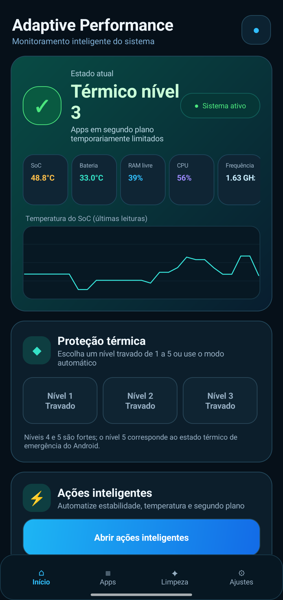
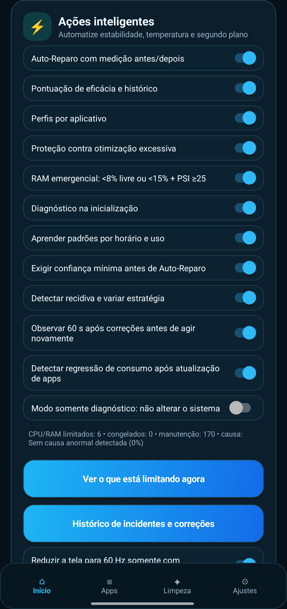
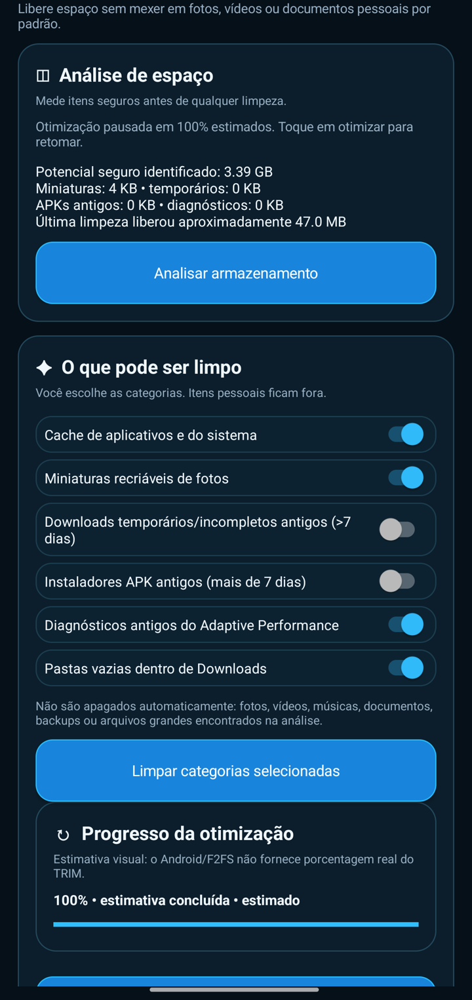

# Adaptive Performance

Android utility focused on adaptive performance, thermal control, RAM/CPU pressure management, safe background restrictions, diagnostics and storage maintenance. The project is designed for Android devices with Shizuku access and does not require root.

## Vídeo de apresentação

[▶ Assista ao vídeo do Adaptive Performance (19 segundos)](https://github.com/langraficagr-collab/adaptive-performance/releases/download/v1.4.8/AdaptivePerformance-divulgacao.mp4)

Demonstração com gravação real do aplicativo, narração em português e cena ilustrativa gerada por IA no Vibes. Os resultados variam conforme o aparelho; as funções avançadas usam Shizuku.

[Baixar o APK](https://github.com/langraficagr-collab/adaptive-performance/releases/latest)

## Prints do aplicativo

| Painel e proteção térmica | Ajustes e ações inteligentes | Limpeza de armazenamento |
|---|---|---|
|  |  |  |

Capturas reais da versão instalada no Poco X7. Valores e opções variam conforme o aparelho e a versão.

## Main features

- RAM, CPU, LMKD/zRAM and pressure monitoring.
- Thermal monitoring and adaptive thermal protection.
- Safe background-app restriction with progressive rollback.
- Manual app freeze/unfreeze with watchdog and Android 16 handling.
- Automatic cause detection, confidence score, recurrence detection and Auto-Repair.
- Per-app adaptive profiles and time-of-day usage learning.
- Wakelock diagnostics and deep-sleep monitoring.
- Incident history, health history and diagnostic export.
- Advanced storage-cleanup tab with cache analysis, old temporary files, old APK installers and large-file discovery.
- F2FS/flash storage maintenance using Android maintenance/TRIM commands.
- Estimated TRIM progress display and safe pause/abort support.
- Shizuku-based privileged operations without root.

## Safety principles

The app avoids aggressive actions against the foreground app, system components and protected apps. Temporary restrictions store previous state so they can be rolled back. Personal media and documents are excluded from automatic storage cleaning by default.

The storage "defragmentation" option is intentionally implemented as Android/F2FS maintenance/TRIM rather than traditional HDD-style defragmentation. Android does not expose real TRIM completion percentage, so the displayed progress is explicitly an estimate.

## Requirements

- Android 16 is the primary tested target.
- Shizuku for privileged Android shell operations.
- Android SDK / Gradle for building.

## Build

```bash
gradle :app:assembleDebug --no-daemon
```

Debug APK output:

```text
app/build/outputs/apk/debug/app-debug.apk
```

## Project structure

- `app/src/main/java/com/mauricio/adaptiveperformance/` — application source.
- `MainActivity.java` — main dashboard and navigation.
- `OptimizationService.java` — background monitoring and optimization service.
- `StorageCleanupActivity.java` — advanced storage cleanup and TRIM interface.
- `CpuPressureController.java` — CPU/background pressure control and rollback.
- `SystemBatteryController.java` — battery, sleep and wakelock policies.
- `ExtendedDiagnosticsController.java` — extended diagnostics and probable-cause analysis.
- `AdaptiveIntelligenceController.java` — confidence, recurrence and adaptive learning.

## Notes

This repository intentionally excludes local SDK paths, generated APKs/build output, development backups and credentials.
